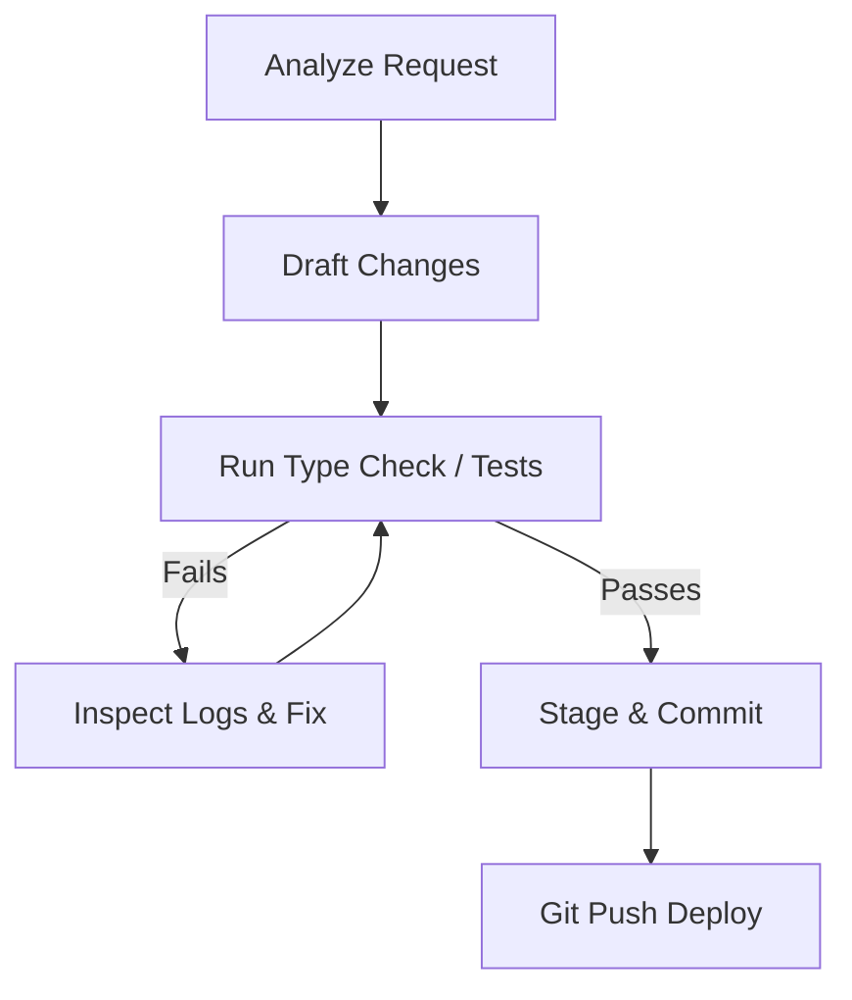

# Autonomous Loop Skill

This skill outlines how to run autonomous planning, coding, testing, bug-fixing, committing, and deployment cycles to complete tasks with high reliability and zero manual intervention.

## 1. Loop Principles
- **Analyze & Discover**: Always research files, schemas, and endpoints using targeted search tools before changing any files.
- **Fail Closed / Handle Errors**: If typechecks or tests fail, inspect the compilation logs, analyze the specific lines, resolve the bugs, and verify again. Do not stop until all tests pass.
- **Git State Sync**: Stage and commit code as soon as a feature is completed and typechecks pass. Push to origin main to trigger automated deployments immediately.

## 2. Execution Cycle Workflow

### Step 1: Research & Planning
- Locate target files.
- Read exact code lines, type definitions, and API specifications.
- Check database constraints and existing migration files.

### Step 2: Code Adjustments
- Perform edits using precise line-replacement tools.
- Write fallback values to ensure type safety (e.g. fallback error strings or default arguments).

### Step 3: Local Verification
- Run compilation checks (`npm run check-types`) to prevent syntax or TypeScript type errors.
- If there are errors, read the exact file line numbers and adjust the code.

### Step 4: Commit & Deploy
- Stage all completed microservice and client changes.
- Commit using standard, descriptive messages.
- Run `git push origin main` to deploy the updates live.
